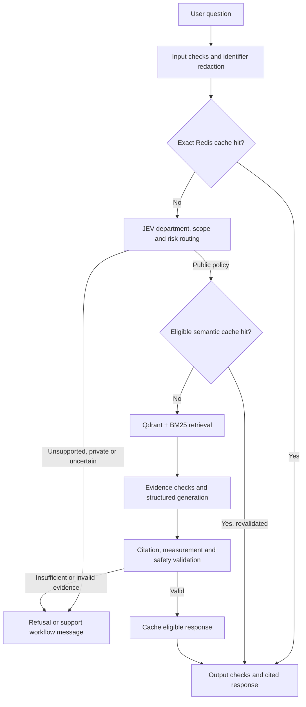

# AeroNova — Airline Policy Assistant

A Python RAG assistant for answering airline policy questions with traceable source evidence. AeroNova combines department-aware routing, hybrid search, structured answers, and Redis caching to explore how an AI support assistant can reuse reliable answers and abstain when evidence is missing.

**Stack:** Python · LangChain · OpenAI · Qdrant · BM25 · Redis · Docker Compose · Arize Phoenix · RAGAS

> AeroNova Airways and its data are fictional. This is a CLI development and evaluation project; it is not connected to a real airline or customer account system.

## What this project demonstrates

- **Hybrid retrieval:** Qdrant vector search and BM25 keyword search, merged with weighted Reciprocal Rank Fusion.
- **Policy-aware evidence:** department and year filters, requested-date validity checks, source metadata, and a small ranking boost for primary policies.
- **Grounded generation:** structured responses with chunk citations; checks that cited chunks exist and that selected numerical claims are supported by cited text.
- **Redis answer reuse:** exact-question caching plus conservative semantic caching for eligible public-policy paraphrases.
- **Request routing and safety:** JEV classifies department, public versus customer-specific scope, and risk; local checks redact detected identifiers and inspect inputs, retrieved context, and outputs.
- **Observability and evaluation:** Phoenix traces, step timings, offline regression tests, and a RAGAS runner with a golden dataset.

## How it works



The public index is built from selected policy and web documents. Chunk metadata preserves document IDs, source files, pages, policy years, validity windows, authority, and department.

Current public RAG departments are **baggage, disruptions, refunds and claims, cabin and onboard, general policies, and upgrades**. Customer-specific requests receive a secure-workflow message instead of querying public RAG.

## Run locally

### Prerequisites

- Python with virtual-environment support and Docker Compose.
- An OpenAI API key for embeddings and answer generation.
- An OpenCode API key for the configured JEV classifier. Without it, routing falls back to a support/review message.
- The **Tesseract OCR executable**, installed separately from the Python package. For example, use `sudo apt-get install tesseract-ocr` on Ubuntu or `brew install tesseract` on macOS.

### 1. Install dependencies

```bash
git clone https://github.com/Priya-raja/Agentic_System_Design.git
cd Agentic_System_Design/rag_airlines

python -m venv .venv
source .venv/bin/activate
# Windows PowerShell: .venv\Scripts\Activate.ps1
python -m pip install -r requirements.txt
```

Create a `.env` file in `rag_airlines/`:

```dotenv
OPENAI_API_KEY=your_openai_api_key
OPENCODE_API_KEY=your_opencode_api_key
```

The project ignores `.env`. Keep real credentials out of commits.

### 2. Start the local services

```bash
docker compose up -d
docker compose ps
```

| Service | Local address | Purpose |
| --- | --- | --- |
| Qdrant | http://localhost:6333 | Vector storage and search |
| Redis | `redis://127.0.0.1:6379/0` | Exact and semantic answer caches |
| Phoenix | http://localhost:6006 | Trace inspection |

### 3. Build the index and start the assistant

Run these commands from `rag_airlines/`:

```bash
python -m context.indexers.build_index
python -m agent.factory
```

The index builder replaces the local `aeronova_public_knowledge` collection and writes `index_state.json`. Build it on a fresh setup even though an index-state file is included in the repository. Rebuild after changing corpus files or index metadata; startup checks reject a stale corpus fingerprint or schema.

Indexing, routing, generation, and eligible semantic-cache operations call external APIs and may incur provider charges.

### Example questions

```text
What is the checked baggage allowance for Economy Flex in 2026?
Can Economy Flex upgrade directly to Business in 2026?
Can Premium Economy Standard upgrade to Business in 2026?
What are the damaged baggage claim rules in 2026?
```

The CLI prints routing decisions, retrieval timings, the answer or refusal, and source evidence where applicable. Type `exit` to finish.

To inspect retrieval without generating an answer:

```bash
python -m context.indexers.retrieve
```

Legacy entry points `python build_index.py` and `python answer.py` remain available. For programmatic initialization, `agent.factory.create_agent()` returns the loaded prompt, prepared chunks, and vector store after freshness checks; it does not build the index.

## Caching design

| Cache | Reuse rule | Expiry and invalidation |
| --- | --- | --- |
| Exact answer | Same lowercased, whitespace-normalized question; eligible public RAG payload | 24 hours; key includes prompt hash, index-state hash, and pipeline version |
| No-context result | Same eligible public RAG question with empty retrieval results | 5 minutes; exact cache only |
| Semantic answer | Validated, answerable public-policy response; matching scope, wording signature, and cosine similarity ≥ 0.97 | 24 hours; at most 100 entries per scope; scope includes department, policy year, prompt version/hash, corpus version, pipeline version, embedding model, and calendar day |
| OpenAI prompt cache | Provider-managed reuse of eligible matching prompt prefixes | Provider controlled; a stable prompt-content key is supplied, but a hit is not guaranteed |

Semantic reuse preserves the answer and its retrieved source chunks. Significant question terms must match in order, with a small alias set such as *luggage → baggage*. Personal, conditional, comparative, negated, and relative-date questions bypass this cache. A semantic hit is revalidated and populates the exact cache for the new question.

Redis or semantic embedding failures fall back to normal retrieval and generation. Semantic lookup can call the embedding API after candidate guards pass, and storing an eligible answer also embeds the question.

## Grounding, routing, and safety

- Public indexing selects policy and web sources, including the allowed baggage-update image. Synthetic CRM records and voice data are excluded from the public knowledge collection.
- Retrieval requires applicable primary evidence before generation. Missing context produces an abstention rather than an unsupported policy answer.
- Responses use `answerable`, `answer`, `citation_chunk_ids`, and `refusal_reason`. Citation validation checks membership in the retrieved chunks.
- Measurement checks compare selected units such as kg, cm, AED, hours, and days against cited evidence. These checks are narrower than full factual verification.
- Detected personal identifiers are redacted before routing and question tracing. Safety checks also gate caching and inspect retrieved content and generated output.
- JEV records a model-tier decision, but answer generation currently uses the configured `ANSWER_MODEL`; tier-based model switching is not implemented.
- Authentication, booking changes, live inventory, claims processing, CRM access, and actual support handoffs are not connected. Routing messages describe these boundaries.

## Tests and evaluation

Run the offline regression suite:

```bash
python -m unittest discover -s tests -v
```

Tests cover semantic-cache guards and failure fallback, no-context caching, safety and insult handling, department/topic filtering, and upgrade routing.

Run a small evaluation against [the golden dataset](evals/golden_dataset_v1.jsonl):

```bash
python evals/run_ragas_eval.py --limit 3
```

The runner evaluates retrieval and answer generation using **context precision, context recall, faithfulness, and factual correctness**, alongside abstention behavior and expected-document recall. It writes timestamped per-case JSONL outputs and JSON summaries to [`evals/results/`](evals/results/).

Evaluation uses external APIs, including an LLM judge. Recorded results are development snapshots, not a production accuracy guarantee; inspect individual cases and metric errors alongside aggregate scores. This runner does not benchmark the full interactive cache and safety pipeline.

## Repository guide

| Path | Responsibility |
| --- | --- |
| [`agent/factory.py`](agent/factory.py) | CLI orchestration, structured generation, grounding validation |
| [`agent/jev_classifier.py`](agent/jev_classifier.py), [`agent/router.py`](agent/router.py) | Department/scope/risk classification and support routing |
| [`context/ingest/`](context/ingest/) | Document loading, OCR, public selection, metadata, chunking |
| [`context/indexers/`](context/indexers/) | Qdrant index building, freshness checks, hybrid retrieval |
| [`context/memory/`](context/memory/) | Exact and semantic Redis caches |
| [`safety/`](safety/) | Input, context, output, cache policy, and overload retry checks |
| [`observability/`](observability/) | Phoenix tracing and step timings |
| [`prompts/`](prompts/) | Versioned answer prompts and changelog |
| [`evals/`](evals/), [`tests/`](tests/) | Golden cases, evaluation runner, regression tests |
| [`data/`](data/README.md) | Fictional policies, web content, and synthetic private records |
| [`config.py`](config.py), [`docker-compose.yml`](docker-compose.yml) | Models, thresholds, cache settings, service configuration |

## Current scope

AeroNova demonstrates a complete local policy-answering workflow with evidence checks and guarded answer reuse. It is a development prototype with a small fictional corpus, a CLI interface, heuristic safety checks, and external-provider dependencies. It has no deployed web API, customer authentication, or live airline integrations, and no published latency, cost-reduction, or production-scale reliability benchmark.

### Upgrade-policy example

The fictional upgrade corpus provides a concrete eligibility test: Economy Saver and Economy Flex cannot upgrade directly to Business, and an originally Economy ticket cannot reach Business through sequential upgrades on the same journey. Premium Economy Standard may upgrade when eligible inventory exists.

The public sources are [the upgrade policy](data/policies/POL-UPG-2026.pdf), [the eligibility table](data/policies/TAB-UPG-ELIGIBILITY-2026.pdf), and [the customer-facing explanation](data/web/WEB-007.md). Synthetic customer offers remain outside the public index; answering an individual booking or live-availability question requires a separate authenticated integration.
